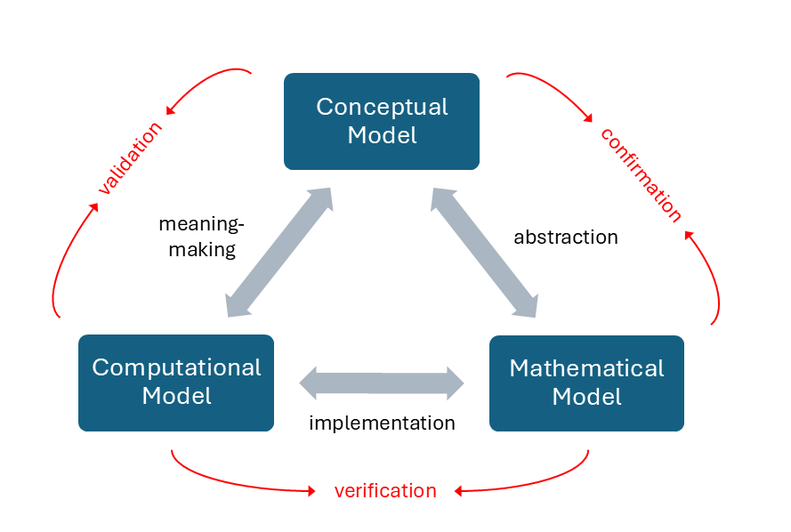
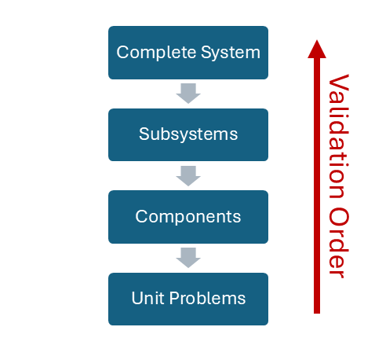

Module 5: Validity, Reliability, and Model Improvement
======================================================

This module will discuss model validity and reliability, two critical aspects of meaningful model-building. Validity is the process of determining that your model has been built correctly and is giving values that make sense within the confines of your system. Reliability covers a number of topics, such as how consistent your model is over repeated runs and how well it runs across various data sets. This section will discuss methods for ensuring validity and reliability, as well as some suggestions for improving models in preparation for publication and sharing.

5.1: Validation vs Verification
-------------------------------

Ensuring model validity is often a complicated process involving multiple rounds of testing and refining. Although not impossible, it is rare that a model will give you exactly the values you expected the first time through. Taking time to test your model and ensuring that it is behaving as expected is a normal part of the process that should jot be overlooked. Before we discuss methods and examples of how to do this, there is a key distinction that should be made up front: the difference between verification and validation. 

Verification is the process of determining whether your model is functioning as expected. In other words, verification involves making sure that all of the calculations, algorithmic steps, and processes are being executed correctly. 

Validation is the process of determining whether your model is producing values that make sense given the conceptual bounds of the real-world system that it represents. 

You can think of verification as the technical aspect of validity and validation as the conceptual aspect. Both of these processes are critical to model validity, so it is important not to confuse the two when assessing model validity. A model that has only been verified may still not be producing useful output, regardless of how robust the code itself is.

A third category of validation is one that is often referred to as "confirmation." The process of confirmation consists primarily of checking to make sure that your mathematical model adequately represents your system of interest *for the questions that you intend to answer*. There are several methods for doing this before implementing your model, but often full confirmation of your mathematical model does not come until the full validation cycle has been established. 

In Module 1.1, we discussed the modeling triangle, and how each model of a system consists of three parts: a conceptual model, a mathematical model, and a computational model. One way to think about the verification and validation process is to envision the categories of validation as happening at the transitions between the three parts of the model, as shown below in Figure [#].

When abstracting your conceptual model into a mathematical model, you must do your due diligence to confirm that the mathematical model is capturing all of the necessary components of your system of interest, and that those components are interacting appropriately (or at least in the way that you intend for them to). When implementing your mathematical model as a computationally executable simulation, you must *verify* that the computer code is (1) free of obvious errors and working properly and (2) calculating your model as intended. Finally, once the simulation is validated and running acceptably, you then use the output from your simulations to determine if the model is *valid*, typically by comparing it to real-world observations and experiments. 

This process is inherently iterative, and no model is ever truly complete or finished. In fact, as we will discuss in section 5.3, it is also not likely that any model can ever be "fully" validated. All models require at least several rounds of iteration through this validation process before they can be considered truly "trustworthy." But with a rigorous and well-specified approach to the trustworthiness of your models, they can be very powerful predictive machines. 

5.2: Methods for Verifying a Model/Simulation
---------------------------------------------

As mentioned above, Verification refers to the process of confirming that your computational model is properly representing the discretized form of your mathematical model. There are two key categories of model verification:

* **Code Verification:** The identification and removal of errors in the code. Debugging the code, essentially. Syntax errors are generally easy to debug, as they keep the code from running at all. However, not all errors in the code are immediately obvious. Some problems only emerge when testing specific combinations of parameter inputs, so it is important to thoroughly test your code under a variety of relevant simulation setups.
* **Calculation Verification:** The quantification of errors introduced when applying the code framework to specific simulations. This type of verification is checking for the stability and reasonableness of the results output by the simulation under various parameter sets. Here we also quantify the error observed during test cases, and seek to improve and refine the timescale and initial parameters of the simulation to reduce error. In other words, calculation verification is answering the question: does the model accurately solve the discretized version of the mathematical model?

One of the simplest methods for verifying your model is running your simulation under conditions that produce a known analytical output. If your model is deterministic, then solving analytically for one or two known conditions and comparing the discretized model output with those results is an easy way to test your setup. We showed a few examples of how to do this in several ODE models in Section 3.1 by outputting the estimated and calculated values together and comparing the error at different time step magnitudes. In addition to testing against known outputs, it is also important to establish a suite of parameter setups to test your simulation across during verification. Although the exact range over which you expect your simulation to perform will depend on the questions you are asking, testing the stability of your model under strange or unexpected parameters will help immensely in verifying the framework.

Unfortunately, many of the things that we like to model in the biological realm often involve a good deal of randomness, making many of our simulations inherently non-deterministic. This complication becomes even further amplified once you start exploring agent-based simulations of multicellular phenomenon. In the case of non-deterministic simulations, accurate benchmark solutions are often used to compare the results of a given simulation to what "should" happen after a certain amount of time if the system is behaving correctly (i.e., as observed).

When testing your code, there are a number of approaches for establishing credibility. Reproducing existing setups is usually the first step. You can verify your model by reproducing setups with:

* **Known analytical solutions:** Comparing your simulation output to an analytical solution of your equation set is the easiest way to verify if the discretized version is performing as expected. There will naturally be some level of discrepency between the two final values, but if the error is acceptable, then this is a solid way to establish credibility between the mathematical and computational models. However, it is important to note that this method only works for deterministic simulations (i.e., models that have a linear progression of states with no randomness). Almost all biological systems have some level of randomness involved, so we will need to pursue other methods of verifying our simulations.  
* **Accurate benchmark solutions:** For non-deterministic simulations, benchmark solutions are a very useful tool. Simulations that incorporate randomness will produce slightly different end results with every run, so it is not as practical to use comparison to analytical solutions as our verification metric. Since we can not compare the output point-by-point like we can with deterministic simulations, we have to switch to using statistical verification methods. In this case, it is often useful to compare your simulation output to what are called "benchmark solutions." These are methods that allow you to essentially compare the likelihood that you are getting an accurate answer based on pre-existing understanding of the system. These benchmark solutions come in a variety of forms:
 * **Analytical Statistical Metrics:** For some stochastic models, we can mathematically derive the expected mean or variance of the model. Your code is accurate if your numerical average converges to this analytical value after numerous test runs.
 * **Exact Distribution Benchmarks:** In specific cases (like the Gillespie algorithm), the entire Probability Density Function (PDF) is known. You can use statistical tests (like Kolmogorov-Smirnov) to see if your model's output distribution matches the theoretical one.
 * **High-Fidelity "Gold Standard" Runs:** If no analytical solutions exist, you can run a massive number of samples using another trusted, verified code. This "over-resolved" result becomes the benchmark for developing faster, less-expensive models. 

**[Add examples]**

5.3: Methods for Validating a Model/Simulation
----------------------------------------------

Validation is the process of making sure that your model is solving the "right" equations, thereby ensuring that the computational module mimics physical reality. This is distinct from verification, which is simply "solving the equations right" (i.e., checking for code bugs and inconsistencies). Validation of a computational model is slightly more complicated, and requires more thorough planning in advance. Technically, we can't ever completely validate a model, but we can validate a model for a specific range of expected parameters within a specific class of problems. No model is ever "completely" correct, as all models are simplifications of the real-world system. "Model validation" is perhaps somewhat of a misnomer; "calculation validation" or "application validation" might be more accurate/appropriate descriptions of the process. However, the common terminology is "model validation," so we will stick with that throughout this text to avoid confusion.

Typically, we think about validation in terms of comparing our simulation results to the results of corresponding experiments. There are some other methods for establishing internal validity of a simulation when no existing data is available for comparison (which we will discuss in a later section). But the gold standard of simulation validation is still comparison to real-world experimental measurements. When validating computational modules against experimental data, the primary objective is to determine if your mathematical representation accurately reflects the physical world. This process relies heavily on the analysis of residuals, which are calculations of the difference between your experimental and computational data. 

Convergence
~~~~~~~~~~~

One commonly used metric for whether a model is performing as expected is the idea of convergence. Convergence, in the context of modeling, means that the simulation output reaches an effective "final state" in which the parameters of the simulation are no longer changing significantly between steps. While it can be tempting to think of this as the simulation "reaching equilibrium," it is important to note that this is not necessarily the case. Rather, convergence of your model signifies that the computational conditions for your simulated system have been fulfilled. Furthermore, we must keep in mind that because the modeler is the one who makes all decisions about the simulation setup, any errors in assumptions or parameterization are carried through into the simulation output (including any convergence states).

So, to reiterate, a simulated system has "reached convergence" when further time steps will no longer make a difference in simulation output. If the converged state of the simulation matches what you would expect to see in the real-world system, then the model is likely on the right track.

Convergence is especially important in stochastic simulations, as each run will produce different outcomes (even with the same starting parameters) due to the randomness in the progression of the simulation. However, there are metrics across each simulation run that should converge toward the same value regardless of the specific spatial output of the simulation. For example, **[Need to add some examples here]**.

Uncertainty Quantification
~~~~~~~~~~~~~~~~~~~~~~~~~~

[Coming in 01/30/26 update.]

5.4: Pairing Models with Experiment
-----------------------------------

[Converting/expanding content from Hengenius paper, will be up with 01/30/26 update]

Building Sub-Systems
~~~~~~~~~~~~~~~~~~~~

Biological systems are often complex, and it is difficult to understand the outcomes of specific biological processes without mapping them to the processes and reactions that surround our system of study. Therefore, it is often common in biological modeling for our models to contain multiple components (often called "sub-systems") that pass information to one another throughout the simulation. For large or complex models involving multiple sub-systems, validation can be especially tricky. However, there are some best practices that we can use for making sure that our models don't get out of hand as we add complexity to our base system.

| Validation of sub-systems —> validate each piece first or you won't know where the problem is if the whole-system results don't match.
| └> may require a sequence of validation experiments to build adequate confidence

Sensitivity analysis (on the whole system) can help identify which elements require higher accuracy/fidelity if time or budget constraints require choices (which they always do). —> will be including a section on sensitivity analysis in next update.

Validation metrics —> what standards are needed to call this "good?" Need to provide at least two walk-through examples. Preferrably examples that were shown in previous modules.

Misc. Notes
-----------

| "Expressing results as uncertainties" is an idea that we should include —> a good practice for avoiding over-inflated claims
| └> will need to provide tips on how to do this, though.

If building a model and an experiment in tandem, it is important to work separately until comparable results are obtained. To help avoid the tendency to calibrate towards each other. (This may be a candidate section for our Best Practices module).